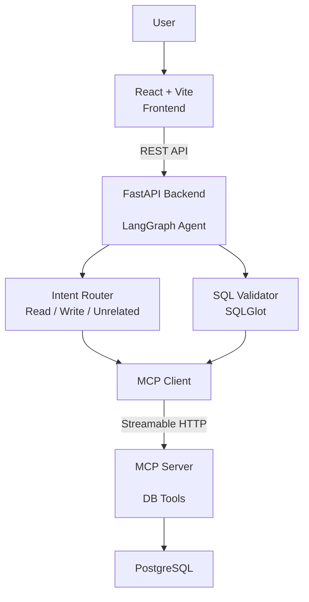
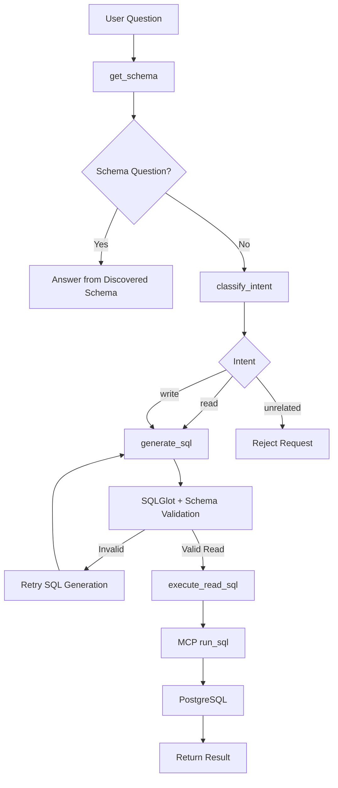
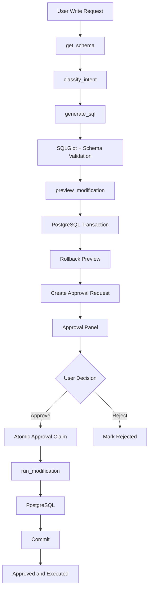
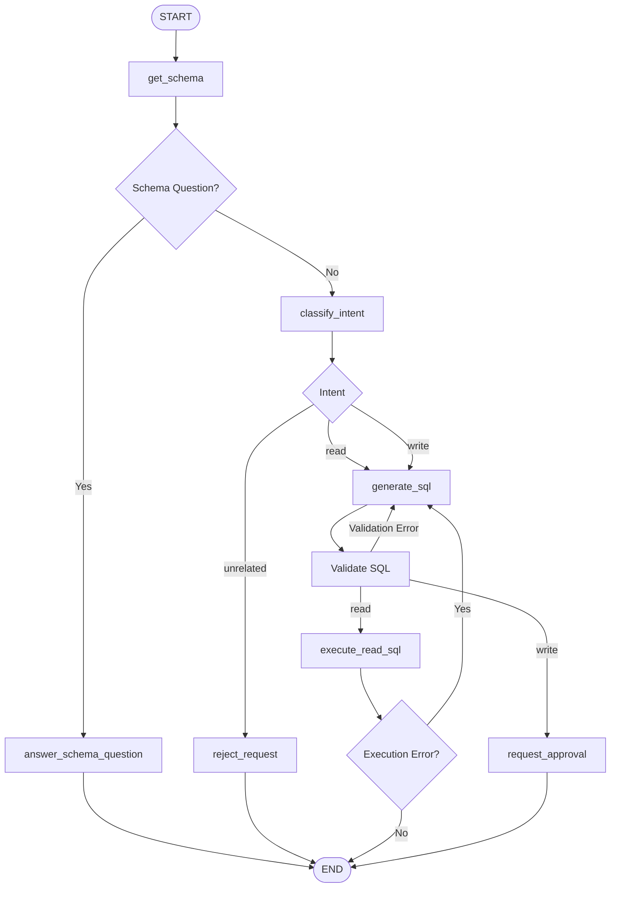
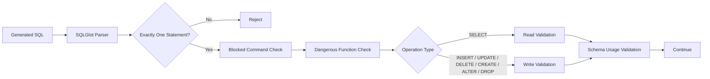
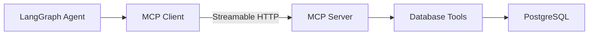
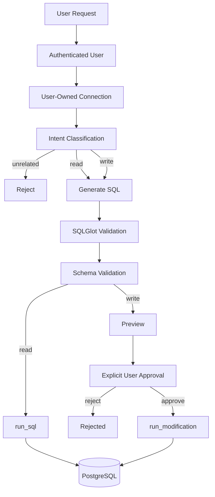

# Intelligent Natural Language Database Interaction System

A natural-language PostgreSQL database agent that uses LangGraph to classify requests, generate SQL, validate SQL against the connected database schema, and execute database operations through a separate MCP server.

The application supports both **read operations** and **write operations with explicit user approval**.

---

## Features

* Natural-language interaction with a PostgreSQL database
* User registration and login
* JWT-based authentication stored in an HTTP-only cookie
* Per-user database connection sessions
* PostgreSQL connection testing
* Runtime database connections using opaque connection IDs
* Database credentials are not stored in browser `localStorage`
* Database credentials are kept in the backend/MCP runtime connection manager
* Dynamic PostgreSQL schema discovery
* Schema questions handled directly from discovered schema information
* LangGraph-based agent workflow
* LLM-based intent classification:

  * `read`
  * `write`
  * `unrelated`
* Groq as the primary LLM
* Ollama as the fallback LLM
* SQL generation using the discovered database schema
* SQLGlot AST-based SQL validation
* Schema/table/column validation
* Read queries execute directly
* Write queries require explicit approval
* Write-operation preview before execution
* Approval records stored in PostgreSQL
* Atomic approval claiming to prevent duplicate execution
* MCP client/server separation
* MCP communication over Streamable HTTP
* MCP internal authentication using signed context
* Maximum 100 rows returned from read queries
* SQL generation/execution retry mechanism
* Optional LangSmith configuration

---

# Architecture



---

# Request Flow

## Read request



---

# Write Request Flow

Write operations are **not executed immediately**.



The preview executes the generated modification inside a transaction and rolls it back. The actual modification is executed only after the approval request has been approved.

---

# LangGraph Workflow

The agent is implemented as a LangGraph `StateGraph`.



The agent state contains fields including:

* `question`
* `connection_id`
* `schema`
* `intent`
* `sql`
* `result`
* `preview`
* `error`
* `sql_error`
* `semantic_error`
* `retry_count`
* `approval_required`
* `request_id`

---

# Intent Classification

The intent router uses an LLM rather than a fixed keyword-only router.

The available intent values are:

```text
read
write
unrelated
```

Examples defined by the application:

```text
How many users are there?
→ read

Show all users from Pune
→ read

Update user 5
→ write

Delete inactive users
→ write

Create a products table
→ write

Who is the president of India?
→ unrelated
```

Groq is attempted first. If the Groq request fails or produces an unexpected router response, the application falls back to Ollama.

---

# Schema Discovery

Before processing a database question, the agent requests the schema through the MCP server.

The database layer queries PostgreSQL's:

```text
information_schema.columns
```

for the `public` schema.

The discovered schema contains information for each column including:

* column name
* data type
* nullable status
* default value
* primary-key status

Conceptually, the returned structure is:

```json
{
  "table_name": {
    "columns": [
      {
        "name": "id",
        "type": "integer",
        "nullable": false,
        "default": null,
        "primary_key": true
      }
    ]
  }
}
```

The exact schema depends on the connected PostgreSQL database.

---

# Built-in Schema Questions

The agent contains explicit handling for several schema-related questions.

It can identify requests for:

### Table count

Examples:

```text
How many tables are there?
Number of tables
Count tables
```

### Table names

Examples:

```text
List tables
Show all tables
What are the tables?
Names of tables
```

### Full schema

Examples:

```text
Show database schema
Show the schema
Full schema
Describe the database
```

### Table columns

For example:

```text
Show columns of users
```

### Primary keys

For example:

```text
What is the primary key of users?
```

These responses are generated from the schema discovered from the connected database.

---

# SQL Generation

For normal database questions, the agent generates exactly one PostgreSQL SQL statement.

The SQL generation prompt instructs the model to:

* use only tables existing in the provided schema
* use only columns existing in the provided schema
* preserve important requirements from the user request
* include requested filtering
* include requested sorting
* include requested aggregation
* avoid multiple statements
* return SQL only

The generated SQL is subsequently validated by application code.

---

# SQL Validation

SQL validation is implemented using SQLGlot with the PostgreSQL dialect.



## Single-statement validation

The validator rejects SQL containing more than one parsed statement.

For example:

```sql
SELECT * FROM users;
DELETE FROM users;
```

is rejected.

---

## Blocked SQL commands

The validator explicitly blocks:

```text
GRANT
REVOKE
COMMENT
BEGIN
COMMIT
ROLLBACK
SAVEPOINT
RELEASE
COPY
CREATE DATABASE
DROP DATABASE
ALTER DATABASE
CREATE EXTENSION
```

---

## Dangerous PostgreSQL functions

The validator checks for these functions:

```text
pg_read_file
pg_write_file
pg_ls_dir
lo_import
lo_export
dblink_connect
```

and rejects queries containing them.

---

# Read Operations

Read SQL is validated using `validate_read_sql()`.

The root SQLGlot AST node must be a `SELECT`.

Therefore, a read operation cannot pass validation if its root AST node is another SQL operation.

After validation, the query is sent to the MCP server through:

```text
run_sql
```

The database layer executes the query and returns at most:

```text
100 rows
```

---

# Write Operations

Write SQL is handled separately from read SQL.

The implementation supports these write AST types:

```text
INSERT
UPDATE
DELETE
CREATE
ALTER
DROP
```

Write SQL is validated using `validate_write_sql()`.

For `DROP`, the implementation additionally restricts the object type to:

```text
DROP TABLE
DROP VIEW
DROP INDEX
DROP SCHEMA
```

Other `DROP` object types are rejected.

---

# Write Approval System

A write request follows this process:

```text
User Request
     ↓
Intent = write
     ↓
Generate SQL
     ↓
Validate SQL
     ↓
Preview Modification
     ↓
Create Approval Request
     ↓
User Reviews SQL + Preview
     ↓
Approve OR Reject
```

The frontend displays an approval panel containing:

* generated SQL
* operation
* target, when available
* affected rows, when available
* `Approve & Execute`
* `Reject`

---

# Modification Preview

Before approval, the database layer:

1. Validates the write SQL.
2. Starts a transaction.
3. Executes the generated modification.
4. Reads the affected-row count.
5. Rolls the transaction back.
6. Returns the preview.

The preview does not commit the modification.

The actual execution happens only after approval.

---

# Approval Store

Approval requests are stored in the PostgreSQL database configured through `AUTH_DATABASE_URL`.

The application creates an `approval_requests` table containing:

```text
id
user_id
connection_id
question
sql
preview
status
created_at
updated_at
```

Supported approval statuses are:

```text
pending
approved
rejected
failed
```

The approval store also creates indexes on:

```text
user_id
status
connection_id
```

---

# Atomic Approval

When a user approves a request, the application atomically changes the request from:

```text
pending → approved
```

The update requires:

* matching request ID
* matching authenticated user ID
* current status of `pending`

This prevents an already-processed approval request from being executed again through another approval request.

If execution fails after the request has been claimed, the approval status is changed to:

```text
failed
```

---

# MCP Architecture

The project separates the agent from database tools using MCP.



The MCP server runs independently from the FastAPI agent process.

---

# MCP Tools

The MCP server exposes the following tools.

## `connect_database`

Creates a runtime PostgreSQL connection for the authenticated user.

Input includes:

```text
database_url
mcp_context
```

The connection manager creates a UUID-based connection ID.

The returned connection information includes:

```text
connection_id
database_name
host
version
```

---

## `disconnect_database`

Disconnects a runtime database connection belonging to the authenticated user.

---

## `current_database_connection`

Returns information about a currently active connection belonging to the authenticated user.

---

## `database_schema`

Discovers the schema of the connected PostgreSQL database.

---

## `run_sql`

Executes a validated read query.

The MCP layer validates the query before calling the database execution layer.

---

## `preview_modification`

Validates and previews a write operation using a transaction that is rolled back.

---

## `run_modification`

Validates and executes an approved write operation.

The database transaction is committed after successful execution.

---

## `database_health`

Verifies that the authenticated user owns the specified connection and returns:

```json
{
  "status": "healthy"
}
```

---

# MCP Authentication

Communication between the FastAPI application and MCP server uses an internal authentication context.

The MCP context contains the authenticated user identity and is signed using:

```text
MCP_INTERNAL_SECRET
```

The MCP server verifies:

* authentication context structure
* signature
* timestamp
* expiration

This allows the MCP server to associate database connections and tool calls with the authenticated application user.

---

# Database Connection Management

Database connections are managed by the in-memory `ConnectionManager`.

Each connection stores:

```text
user_id
connection pool
created_at
last_used
database_name
host
version
```

The PostgreSQL connection pool uses:

```text
minconn = 1
maxconn = 5
```

The connection manager uses an inactivity timeout of:

```text
24 hours
```

Expired connections are removed and their pools are closed.

Every successful ownership verification updates the connection's `last_used` timestamp.

---

# Connection Ownership

Database connection IDs are associated with a user ID.

Before a connection is used, the connection manager verifies:

```text
connection_id
+
authenticated user_id
```

A user cannot use a connection belonging to another user.

---

# Credential Handling

The frontend accepts a PostgreSQL connection URL for establishing a connection.

The frontend explicitly does not store the database URL in browser `localStorage`.

Only the returned opaque connection ID is persisted by the database context.

The application code also states that database credentials are not stored in the application database and that the AI agent does not receive the database password.

The connection manager keeps the active database connection information in backend process memory.

---

# Connection Persistence in the Frontend

The frontend stores only the connection ID.

On page reload:

```text
Stored connection ID
        ↓
GET /database/current/{connection_id}
        ↓
Verify current runtime connection
```

A temporary backend/MCP verification failure does not automatically remove the stored connection ID.

An explicit disconnect removes the stored connection ID.

---

# Authentication

The application provides:

```text
Register
Login
Current User
Logout
```

Authentication uses JWT access tokens.

The JWT contains:

```text
sub
iat
exp
```

The token is stored in an HTTP-only cookie.

The cookie configuration includes:

```text
HttpOnly
SameSite=Lax
Secure configurable through AUTH_COOKIE_SECURE
```

The default cookie name is:

```text
dbagent_session
```

The default JWT expiration is:

```text
7 days
```

---

# User Registration

Registration requires:

* email
* password
* Terms & Conditions acceptance

Password validation requires:

* at least 8 characters
* at least one letter
* at least one number

Passwords are hashed using bcrypt with:

```text
12
```

bcrypt rounds.

The user record stores:

```text
id
email
password_hash
terms_version
terms_accepted_at
created_at
updated_at
```

---

# Terms & Conditions

The frontend contains a Terms & Conditions page.

The registration form requires acceptance before account creation.

The application records the configured:

```text
TERMS_VERSION
```

when creating the user.

The current frontend terms page displays:

```text
Version 1.0
```

---

# API Endpoints

## Authentication

```text
POST /auth/register
POST /auth/login
GET  /auth/me
POST /auth/logout
```

## Database

```text
POST /database/test-connection
POST /database/connect
GET  /database/current/{connection_id}
POST /database/disconnect/{connection_id}
```

## Agent

```text
POST /ask
POST /approve/{request_id}
POST /reject/{request_id}
```

## Health

```text
GET /
GET /health
```

---

# Frontend

The frontend is implemented using React and Vite.

The API client sends requests to:

```text
http://localhost:8001
```

and includes credentials with requests so the authentication cookie is sent to the backend.

The configured CORS origins are:

```text
http://localhost:5173
http://localhost:5174
```

---

# Frontend Pages

The application contains the following pages:

```text
LoginPage
RegisterPage
TermsPage
ChatPage
ConnectDatabasePage
SecurityPage
```

The UI also contains components for:

```text
ApprovalPanel
ChatInput
ChatMessage
Header
QueryResult
Sidebar
```

---

# Frontend Contexts

The frontend uses React contexts for:

```text
AuthContext
DatabaseContext
ChatContext
```

## AuthContext

Handles:

* authenticated user
* authentication state
* loading state
* login
* logout
* refreshing the current user

## DatabaseContext

Handles:

* current database connection
* connection ID persistence
* restoring the connection state
* connecting
* disconnecting

## ChatContext

Stores chat messages per authenticated user using browser `localStorage`.

The storage key is derived from the authenticated user's ID.

The context also supports clearing the current user's chat history.

---

# Chat Interface

The database chat accepts natural-language questions.

When a question is submitted, the frontend sends:

```json
{
  "question": "...",
  "connection_id": "..."
}
```

to:

```text
POST /ask
```

A completed read request returns generated SQL and database results.

A write request returns a pending approval request containing:

```text
request_id
question
sql
preview
created_at
```

---

# Example Database Questions

Examples supported by the frontend or agent include:

```text
Show all users

How many records are there?

Show the database schema

How many tables are there?

List all tables

What are the columns of users?

What is the primary key of users?

Which products have less than 10 items in stock?
```

The exact results depend on the schema of the connected PostgreSQL database.

---

# LLM Strategy

The application initializes:

```text
Groq
model: openai/gpt-oss-120b
temperature: 0
```

and:

```text
Ollama
model: configured through OLLAMA_MODEL
default: qwen2.5:3b
temperature: 0
```

Groq is attempted first for:

* intent classification
* SQL generation

Ollama is used as the fallback when the corresponding Groq request fails.

---

# SQL Retry Mechanism

SQL generation and read execution can retry when validation or execution fails.

The number of attempts is controlled by:

```text
MAX_SQL_RETRIES
```

The default configured value is:

```text
3
```

SQL validation errors are passed back into the SQL generation state for subsequent attempts.

---

# Project Structure

```text
dbagent_mcp/
│
├── backend/
│   ├── __init__.py
│   ├── agent.py
│   ├── config.py
│   ├── database.py
│   ├── database_routes.py
│   ├── main.py
│   ├── mcp_client.py
│   ├── mcp_server.py
│   ├── prompts.py
│   ├── query_validator.py
│   ├── sql_validator.py
│   ├── auth.py
│   ├── auth_routes.py
│   ├── auth_dependencies.py
│   ├── mcp_auth.py
│   └── approval_store.py
│
├── frontend/
│   ├── index.html
│   ├── package.json
│   ├── package-lock.json
│   └── src/
│       ├── App.jsx
│       ├── index.css
│       ├── main.jsx
│       │
│       ├── api/
│       │   └── client.js
│       │
│       ├── components/
│       │   ├── ApprovalPanel.jsx
│       │   ├── ChatInput.jsx
│       │   ├── ChatMessage.jsx
│       │   ├── Header.jsx
│       │   ├── QueryResult.jsx
│       │   └── Sidebar.jsx
│       │
│       ├── context/
│       │   ├── AuthContext.jsx
│       │   ├── ChatContext.jsx
│       │   └── DatabaseContext.jsx
│       │
│       └── pages/
│           ├── ApprovalPanel.jsx
│           ├── ChatPage.jsx
│           ├── ConnectDatabasePage.jsx
│           ├── LoginPage.jsx
│           ├── RegisterPage.jsx
│           ├── SecurityPage.jsx
│           └── TermsPage.jsx
│
├── tests/
│   └── test_agent.py
│
├── test_mcp.py
├── requirements.txt
├── .env.example
├── .gitignore
└── README.md
```

---

# Environment Variables

The project uses the following environment variables.

```env
AUTH_DATABASE_URL=

MCP_INTERNAL_SECRET=

GROQ_API_KEY=

OLLAMA_URL=
OLLAMA_MODEL=

MCP_SERVER_URL=

MAX_SQL_RETRIES=

LANGSMITH_TRACING=
LANGSMITH_ENDPOINT=
LANGSMITH_API_KEY=
LANGSMITH_PROJECT=

JWT_SECRET_KEY=
JWT_EXPIRE_DAYS=
AUTH_COOKIE_NAME=
AUTH_COOKIE_SECURE=
TERMS_VERSION=
```

`AUTH_DATABASE_URL` is used for the application authentication and approval-store database.

The configuration also allows `DATABASE_URL` to be used as a fallback for `AUTH_DATABASE_URL`.

Default values implemented in the configuration include:

```text
JWT_ALGORITHM = HS256
JWT_EXPIRE_DAYS = 7
AUTH_COOKIE_NAME = dbagent_session
AUTH_COOKIE_SECURE = false
TERMS_VERSION = 1.0

OLLAMA_URL = http://localhost:11434
OLLAMA_MODEL = qwen2.5:3b

MCP_SERVER_URL = http://127.0.0.1:9000/mcp

MAX_SQL_RETRIES = 3

LANGSMITH_ENDPOINT = https://api.smith.langchain.com
LANGSMITH_PROJECT = database-ai-agent-v2
```

`MCP_INTERNAL_SECRET` is required by the application configuration.

---

# Setup

## 1. Create Python environment

From the project root:

```bash
python -m venv .venv
source .venv/bin/activate
```

Install Python dependencies:

```bash
pip install -r requirements.txt
```

---

## 2. Configure environment

Copy the example environment file:

```bash
cp .env.example .env
```

Configure the required values in `.env`.

At minimum, the application configuration requires:

```env
AUTH_DATABASE_URL=your_postgresql_connection_string
MCP_INTERNAL_SECRET=your_internal_secret
```

For Groq:

```env
GROQ_API_KEY=your_groq_api_key
```

For Ollama:

```env
OLLAMA_URL=http://localhost:11434
OLLAMA_MODEL=qwen2.5:3b
```

For MCP:

```env
MCP_SERVER_URL=http://127.0.0.1:9000/mcp
```

---

# 3. Start Ollama

Start Ollama:

```bash
ollama serve
```

Pull the configured default model:

```bash
ollama pull qwen2.5:3b
```

If `OLLAMA_MODEL` is changed, the corresponding model needs to be available to Ollama.

---

# 4. Start MCP Server

From the project root:

```bash
source .venv/bin/activate
python -m backend.mcp_server
```

The MCP server runs on:

```text
http://127.0.0.1:9000/mcp
```

The server uses:

```text
Streamable HTTP
```

with:

```text
host = 127.0.0.1
port = 9000
stateless_http = false
json_response = true
```

---

# 5. Start FastAPI Backend

Open another terminal:

```bash
source .venv/bin/activate
uvicorn backend.main:app --reload --port 8001
```

The backend runs on:

```text
http://localhost:8001
```

Health check:

```bash
curl http://localhost:8001/health
```

Expected response:

```json
{
  "status": "ok"
}
```

---

# 6. Start React Frontend

Open another terminal:

```bash
cd frontend
npm install
npm run dev
```

The frontend is configured to use the Vite development server.

---

# Testing

Run the Python tests:

```bash
pytest
```

The current test suite includes checks for:

* valid `SELECT`
* rejected `INSERT`
* rejected `UPDATE`
* rejected `DELETE`
* rejected `DROP`
* rejected multiple SQL statements

---

# MCP Test

The repository also contains:

```text
test_mcp.py
```

Run:

```bash
python test_mcp.py
```

The script connects to:

```text
http://127.0.0.1:9000/mcp
```

and calls the:

```text
run_sql
```

tool with a `SELECT COUNT(*)` query against a `users` table.

---

# Security Model

The current implementation uses multiple validation and authorization layers.



Security-related mechanisms implemented in the code include:

* authenticated API access
* user-scoped database connections
* MCP internal authentication
* SQLGlot parsing
* single-statement validation
* blocked command checks
* dangerous PostgreSQL function checks
* schema/table/column validation
* separate read and write SQL validators
* write-operation preview
* explicit approval before modification
* atomic approval claiming
* result limit of 100 rows
* runtime connection expiration
* HTTP-only authentication cookie

---

# Database Operations Supported by the Code

The SQL validator distinguishes between:

### Read

```text
SELECT
```

### Write

```text
INSERT
UPDATE
DELETE
CREATE
ALTER
DROP
```

Write operations are not automatically executed through the normal `/ask` flow. They first create an approval request.

The MCP server exposes separate tools for:

```text
preview_modification
run_modification
```

---

# Important Implementation Detail

The project is **not read-only**.

The current codebase contains a complete write-operation path:

```text
write intent
→ SQL generation
→ write SQL validation
→ modification preview
→ approval request
→ user approval
→ modification execution
→ commit
```

The read path is:

```text
read intent
→ SQL generation
→ read SQL validation
→ run_sql
→ PostgreSQL
```

This distinction is important when describing the project.

---

# Tech Stack

| Layer                       | Technology                 |
| --------------------------- | -------------------------- |
| Frontend                    | React                      |
| Frontend Build Tool         | Vite                       |
| Routing                     | React Router               |
| Icons                       | Lucide React               |
| Backend API                 | FastAPI                    |
| Agent Orchestration         | LangGraph                  |
| Primary LLM                 | Groq `openai/gpt-oss-120b` |
| Fallback LLM                | Ollama                     |
| Default Ollama Model        | `qwen2.5:3b`               |
| Tool Protocol               | MCP                        |
| MCP Transport               | Streamable HTTP            |
| Database Driver             | psycopg2                   |
| Database                    | PostgreSQL                 |
| SQL Parser / Validator      | SQLGlot                    |
| Authentication              | JWT                        |
| Password Hashing            | bcrypt                     |
| Approval Store              | PostgreSQL                 |
| Testing                     | pytest                     |
| Observability Configuration | LangSmith                  |

---

# Dependencies

The backend requirements are defined in `requirements.txt`:

```text
fastapi
uvicorn
psycopg2-binary
python-dotenv
langgraph
langchain-groq
langchain-ollama
langchain-core
langsmith
mcp
pytest
sqlglot
bcrypt
PyJWT
email-validator
cryptography
```

The frontend dependencies are defined in `frontend/package.json`.

---

# Current Limitations

The limitations visible from the current implementation are:

* PostgreSQL is the database system implemented by the database layer.
* LLM-generated SQL can still be semantically incorrect even when it passes structural and schema validation.
* The Ollama fallback requires the configured Ollama model to be available.

---

# Project Goal

The project demonstrates an agentic architecture for interacting with PostgreSQL databases through natural language while separating database tools from the main agent process.

The primary workflow is:

```text
Natural Language
       ↓
Schema Discovery
       ↓
Intent Classification
       ↓
SQL Generation
       ↓
SQLGlot Validation
       ↓
Schema Validation
       ↓
MCP Tool
       ↓
PostgreSQL
```

For write operations, the workflow additionally includes:

```text
Modification Preview
       ↓
Approval Request
       ↓
Explicit User Approval
       ↓
Modification Execution
       ↓
PostgreSQL Commit
```

The implementation combines LangGraph, LLM-based SQL generation, SQLGlot validation, MCP-based database tools, authenticated users, runtime database connections, and an approval workflow for database modifications.
